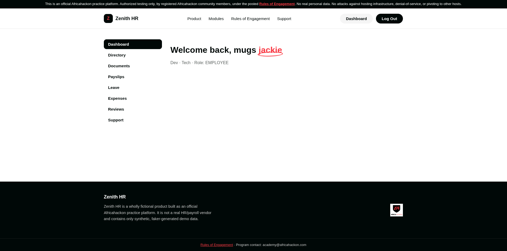
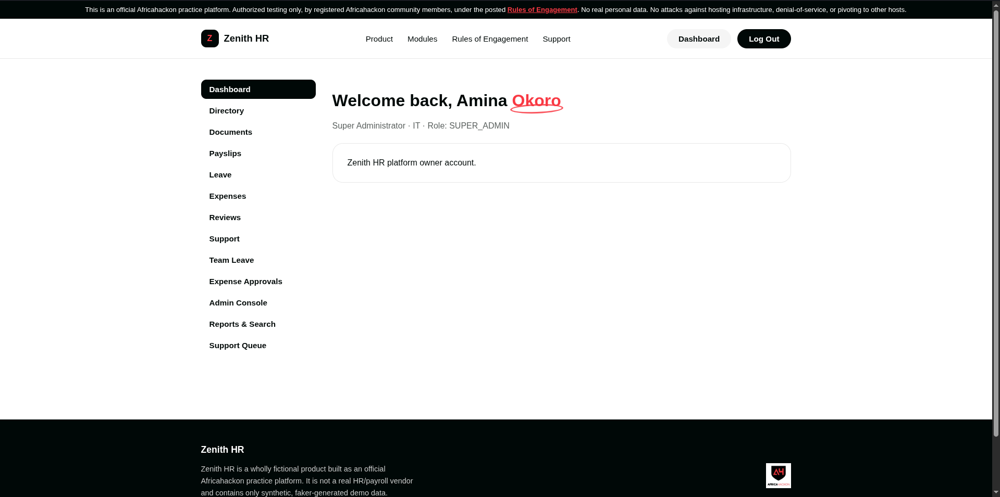

# Zenith HR

Zenith HR is a fictional Enterprise HR & Payroll SaaS application, deliberately built with real,
exploitable vulnerabilities for hands-on security practice. It is an official Africahackon
practice platform.

Zenith HR is not a real company or product, and contains no real employee, customer, or company
data. Every record is synthetic.

Full rules of engagement: `/rules-of-engagement` in the running app.

## What you get

Following the steps below builds and runs a **complete, self-contained copy** of Zenith HR
entirely on your own machine: its own web app, its own API, and its own database loaded with a
full seeded dataset (~230 fake employee accounts, payroll history, leave requests, and more).
Nothing is shared with anyone else and nothing calls out to any external service, everything
runs locally in Docker containers on your machine.

## Screenshots

Regular employee dashboard:



Super Admin dashboard (note the extra Admin Console, Reports & Search, and Support Queue links
that only appear for admin roles):



## Prerequisites

- **Docker** and the **Docker Compose** plugin installed. If you don't have these yet, install
  [Docker Desktop](https://www.docker.com/products/docker-desktop/) (Windows/Mac) or Docker
  Engine (Linux), both include Compose.
- That's it, no other tools, languages, or accounts are required.

## Running this on any machine

```bash
git clone <your-repo-url> zenith-hr   # or copy the folder over some other way
cd zenith-hr
cp .env.example .env
```

Open `.env` and set `POSTGRES_PASSWORD` and `JWT_SECRET` to random values (`openssl rand -hex 24`
works well for both, run it twice for two different values). Then bring the whole stack up:

```bash
docker compose up -d --build
```

This builds and starts everything: the web app, the API, the database, a cache, and a reverse
proxy. The first run takes a few minutes while Docker builds the images; after that, starting
and stopping is instant.

**First run only**, apply the database schema and load the full seed dataset:

```bash
docker compose exec api npx prisma db push --accept-data-loss
docker compose exec api npm run seed
```

The app is now at `http://localhost`. Seeded login (all ~230 accounts): password
`ZenithDemo!2026`, e.g. `super.admin@zenithhr-demo.test`. Self-service signup is also available
at `/signup` if you'd rather create your own account.

## Reset

`scripts/reset.sh` wipes uploaded files and re-seeds the database back to the original fixed
dataset, useful if your testing has left accounts, data, or files in a state you want to clear.

## Testing with an intercepting proxy (Burp Suite, etc.)

If you're using Burp Suite to intercept and inspect traffic, use **Burp's own built-in browser**
(Proxy tab → "Open Browser") rather than manually configuring your regular browser's proxy
settings. It comes pre-configured correctly out of the box and avoids a common headache: most
browsers silently bypass any configured proxy for `localhost` traffic specifically, which means
your own proxy extension settings can look correct while nothing actually routes through Burp. If
you'd rather use your regular browser, disable any proxy extension entirely and configure the
browser's native proxy settings instead (point it at `127.0.0.1:8080`, or whatever port Burp's
listener uses, and make sure `localhost` is not in any "bypass proxy for these hosts" list).
